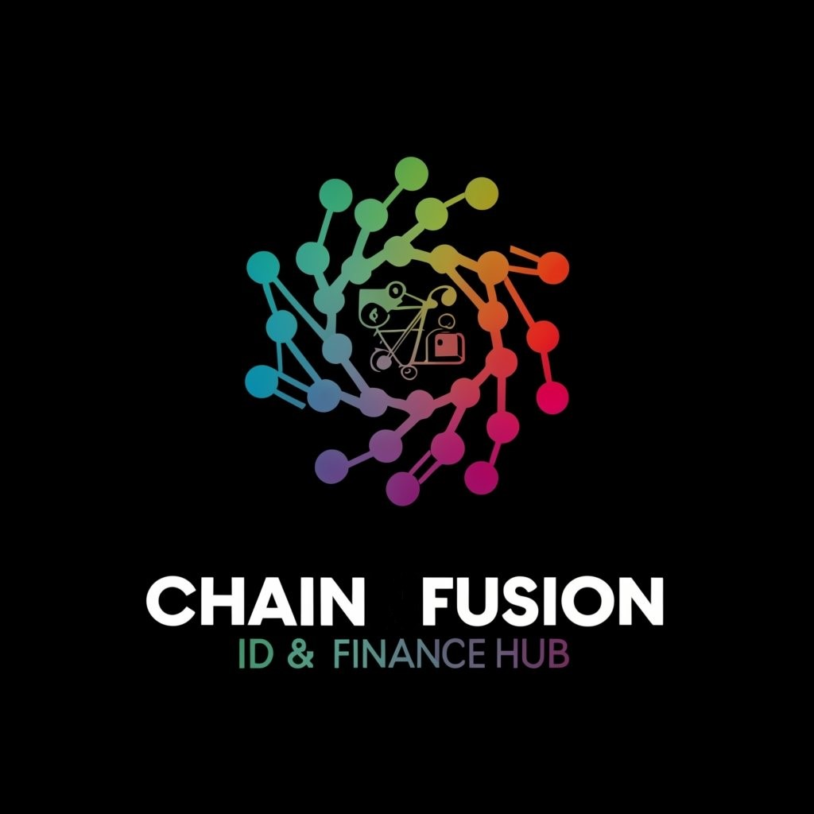

# ChainFusion ID & Finance Hub

    

---

https://github.com/0xBcamp/Aliraza-janus-dragon/assets/32830427/c13c5f82-ed77-4b0c-8c0e-ca489379ca3d

**⚠️ Mandatory Briefing: It is imperative that you play the vidoe file above before proceeding. This message contains critical information crucial for the successful execution of your mission.**

---

## Table of Contents

- [ChainFusion ID \& Finance Hub](#chainfusion-id--finance-hub)
  - [Introduction](#introduction)
  - [The Challenge](#the-challenge)
  - [The Solution](#the-solution)
  - [Why It Matters](#why-it-matters)
  - [Key Features](#key-features)
  - [Impact in the Market and Future](#impact-in-the-market-and-future)
  - [Blueprint of Innovation](#blueprint-of-innovation)
  - [Knowledge Is Our Stronghold](#knowledge-is-our-stronghold)
  - [Examples README to follow](#examples-readme-to-follow)

---

## Introduction

    🌐 <b>The Epoch of Blockchain Evolution</b>

In a world increasingly dominated by sophisticated AI systems, a new vanguard is necessary to maintain the balance between human agency and automated control. This platform, a pioneering initiative in the realm of blockchain and AI integration, is not merely a technological advancement; it's a critical line of defense in an era marked by the rise of AI products and the looming threat of AI-driven cyber incursions.

Our initiative is a beacon of hope, a fusion of blockchain's immutable security and AI's dynamic adaptability. This project transcends conventional digital paradigms, offering a stronghold of safety and user-focused design in the unpredictable terrain of the digital world. It's a venture poised to reshape the narrative of blockchain technology, elevating it from a complex, niche tool to an essential, intuitive element of daily digital interactions. In facing the tide of AI advancements, this project stands as a sentinel, safeguarding the essence of human-driven digital experiences in the blockchain sphere.

## The Challenge

🌐 In a world increasingly dominated by technology, we stand at a critical juncture. The digital realm is evolving at an unprecedented pace, with blockchain and decentralized finance (DeFi) leading the charge. Yet, these powerful systems pose significant challenges in terms of complexity and accessibility. The greater threat, however, comes from the shadowy advancements in AI - from deepfakes to AI-driven cyber attacks, the digital landscape is fraught with perils that could undermine the very fabric of our digital autonomy and security.

## The Solution

🛡️ Enter our pioneering platform - a beacon of resilience in this era of digital uncertainty. This platform is not merely a technological advancement; it is a shield against the burgeoning threats of AI-dominated cyberspace. Harnessing the strength of Moon Wallet's avant-garde technologies, it offers a sanctuary of security and simplicity. This platform serves as a conduit, channeling the formidable force of blockchain to empower users, and providing developers with a robust toolkit to combat the ever-growing complexities of AI infiltration in our digital lives.

## Why It Matters

💡 In the race to a future where digital and physical realities converge, our platform is more than just a tool - it's a necessity. It stands as a bastion of hope against the rising tide of AI-induced chaos, offering clarity and control in the often opaque waters of blockchain and AI interactions. This platform is pivotal because it returns control to where it belongs - in the hands of the users, ensuring that the trajectory of blockchain technology is guided by human values and needs, not by the obscure agendas of autonomous AI entities.

## Key Features

    🎯 <b>Carving a Path Towards Digital Renaissance</b>

This integrated platform would offer a robust toolkit for developers and users in the decentralized finance (DeFi) ecosystem. Key features would include:

- **ERC-4337 Account Abstraction Toolkit:** A set of tools and APIs for developers to seamlessly integrate ERC-4337 Account Abstraction into DeFi applications. This would simplify wallet creation and management, making it more user-friendly and accessible.

- **Decentralized Identity Verification Module:** Leveraging blockchain technology for secure and verifiable user identity management. This module would ensure that users can prove their identity without compromising privacy, essential for KYC (Know Your Customer) and anti-money laundering (AML) compliance in financial applications.

- **Comprehensive DeFi Dashboard:** A user-friendly interface that aggregates various DeFi services like lending, borrowing, staking, and yield farming. The dashboard would utilize Moon Wallet's features for secure transactions and account management.

- **Subscription Management System for Web3 Services:** A system to handle subscriptions for various Web3 services, integrated with the DeFi dashboard. This would allow users to manage recurring payments for services within the DeFi ecosystem, using cryptocurrency and smart contract functionalities.

This platform aims to provide a one-stop solution for both developers and end-users in the DeFi space, enhancing user experience, security, and functionality. It would be particularly beneficial for those looking to engage with DeFi services in a more integrated and streamlined manner.

## Impact in the Market and Future

    💥 <b>Envisioning a Future Forged by Innovation</b>

ChainFusion is poised to be a catalyst in the blockchain and DeFi realms by:

- **Elevating User Interactions**: Redefining the standards of user engagement with blockchain technologies.
- **Accelerating Blockchain Integration**: Paving the way for seamless adoption of blockchain across diverse sectors.
- **Igniting a Chain Reaction of Innovations**: Setting the stage for future advancements, inspiring new blockchain functionalities and services.

## Blueprint of Innovation

    🛠 <b>Architecting the Future</b>

**Building the Digital Eden:**
- **Frontend Mastery**: Crafting an interface that embodies the future - visually stunning, intuitively navigable, and a testament to our commitment to excellence.
- **Backend Fortress**: Constructing a backend that is not just robust but a labyrinth of secure, scalable, and seamless integrations, including Moon Wallet’s APIs.
- **Smart Contracts Alchemy**: Ensuring each smart contract is a tapestry of security, efficiency, and transparency, woven with the threads of blockchain technology.
- **Blockchain Symphony**: Harmonizing various blockchain technologies to create a diverse yet unified digital ecosystem.

**Epic of Development:**
1. **Genesis of Concepts**: Embarking on a journey to envision and design the functionalities and aesthetics of ChainFusion.
2. **Forge of Creation**: Leveraging the Moon Wallet SDK and a plethora of resources to sculpt our vision into reality.
3. **Crucible of Trials**: Subjecting our creation to a gauntlet of tests, ensuring its fortitude and readiness.
4. **Ascension of Deployment**: Launching ChainFusion into the orbit of public use, marking a new chapter in blockchain technology.
5. **Epoch of Evolution**: Committing to a path of continuous improvement, adapting to the ever-changing digital landscape.

## Knowledge Is Our Stronghold

    📚 <b>Dive into the Depths of Our Resources</b>

Embark on a journey through the resources that fuel the heart of ChainFusion:

- **Moon Wallet Odyssey**: [Discover Moon Wallet's capabilities](https://usemoon.ai/), the foundational cornerstone of ChainFusion.
- **Moon SDK Chronicles**: [Explore practical applications of Moon SDK](https://github.com/moon-up/moon-sdk/tree/main/examples/moon-siwe-sdk-example) and draw integration inspiration.
- **Moon SDK Packages**: [Explore all the packages regarding Moon SDK](https://github.com/moon-up/moon-sdk/tree/main/packages) for proper integration and installation. These packages have:
  - Moon-API is the core API call logic
  - Moon-ethers is ethers.js provider and signer classes
  - Moon-rainbowkit allows you to plug moon into rainbow kit
  - Moon-react is a work in progress but will eventually contain a lot of boilerplate components and hooks for moon
  - Moon-sdk is the core logic which contains all session management logic as well as ensuring compatiblity to the wider ecosystem.
  - Moon-types is for shared typings across the moon-sdk project
  - Moon-wagmi-connector is a wagmi connector
- **Moon Auth Token**: With moon-sdk we create an instance of the sub api classes in the moon-sdk and expose them and then also set tokens on updates with all of them.
  - [Configuration snippet security-related settings for AccountsSDK](https://github.com/moon-up/moon-sdk/blob/main/packages/moon-sdk/src/moon.ts#L400)
  - [Configuration snippet for initializing an instance of Accounts](https://github.com/moon-up/moon-sdk/blob/main/packages/moon-sdk/src/moon.ts#L84)
  - [Authorization header using a JWT (JSON Web Token)](https://github.com/moon-up/moon-sdk/blob/main/packages/moon-sdk/src/auth.ts#L3)
- **Example Moon Apps**: Some example moon apps to consider for learning and proper understanding on how to integrate Moon wallet with any project
  - [Moon authentication chat example](https://github.com/moon-up/moon-sdk/tree/main/examples/moon-sdk-authentication-chat-example-app)
  - [Working BCAMP tutorial by Gerdusx](https://github.com/0xBcamp/Gerdusx-janus-dragon/tree/main/bcamp-tutorial/client)
- **Accounts API Codex**: [Unravel the secrets of the Accounts API](https://github.com/moon-up/moon-sdk-python/blob/main/docs/AccountsApi.md) for backend prowess.
- **AI Integration Saga**: [Delve into AI integration](https://python.langchain.com/docs/integrations/tools/chatgpt_plugins) to enhance ChainFusion's capabilities.
- **Moon SIWE Epic**: [Examine a live example](https://github.com/ewhal/moon-siwe-example/blob/main/web/src/index.js) of Moon Wallet’s integration and strength.
- **React Hooks Enigma**: [Uncover the mysteries of Moon React hooks](https://github.com/moon-up/moon-sdk/blob/main/packages/moon-react/src/hooks/useMoon.ts) for intuitive UI design.
- **Moon API Tome**: [Navigate the comprehensive Moon API](https://docs.usemoon.ai/api) for advanced functionality insights.
- **Python SDK Scrolls**: [Embark on a journey with Moon SDK's Python documentation](https://github.com/moon-up/moon-sdk-python/tree/main/docs) for Python-based integrations.
- **Master Plan Compendium**: [Access the detailed master plan](https://docs.google.com/document/d/1Muqq1OAqLg6gQ6A1pycl0cTqAu4x08INJrXFW5Mn9v4/edit) for deep strategic insights.

---

    🚀 <i>Your mission to reshape the digital cosmos begins now. Embark on this journey with valor and vision. Godspeed, apprentice.</i>

---

## Examples README to follow
- Homechain https://github.com/0xBcamp/March-2023-Lima
- SmartVault https://github.com/0xBcamp/March-2023-Sierra
- Blockbadge https://github.com/0xBcamp/Sept23_Apprenticeship_Certification
